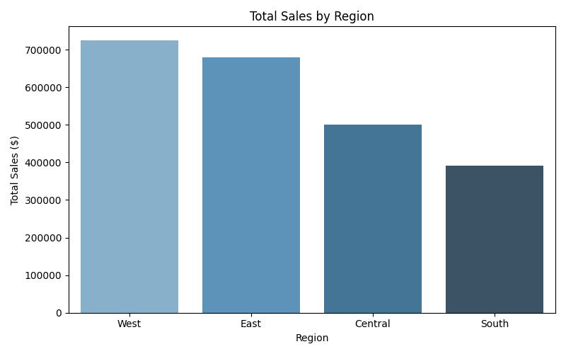
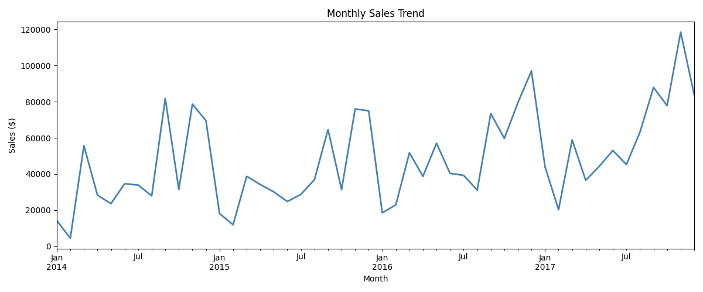
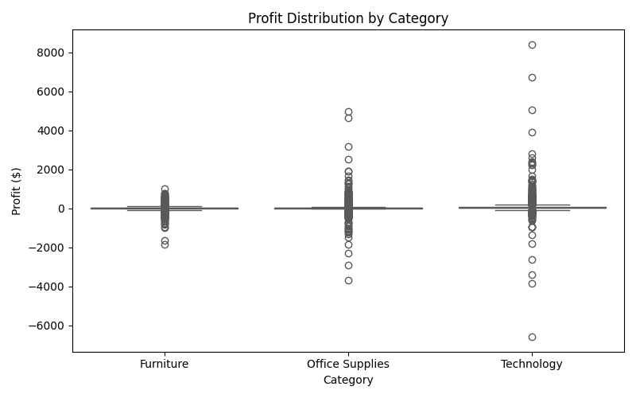

# 🛒 Superstore Sales Analysis

## 📌 Project Overview
End-to-end data analysis project analyzing 9,994 sales transactions 
from a retail superstore to uncover business insights and performance trends.

## 🛠️ Tools & Technologies
- **Python** (Pandas, Matplotlib, Seaborn)
- **PostgreSQL** (pgAdmin)
- **SQL** (CTEs, Window Functions, Aggregations)
- **Jupyter Notebook**
- **Git & GitHub**

## 📊 Key Findings
- West region leads in total sales ($725K) and profit margin (14.94%)
- Central region underperforms with only 7.92% profit margin despite $500K+ in sales
- High discounts (>40%) result in negative average profit per order
- Technology category drives the highest profit across all regions

## 📁 Project Structure
- `notebooks/` - Jupyter notebook with Python analysis & visualizations
- `sql/` - SQL queries for data exploration
- `visualizations/` - Charts and graphs

## 📈 Visualizations

